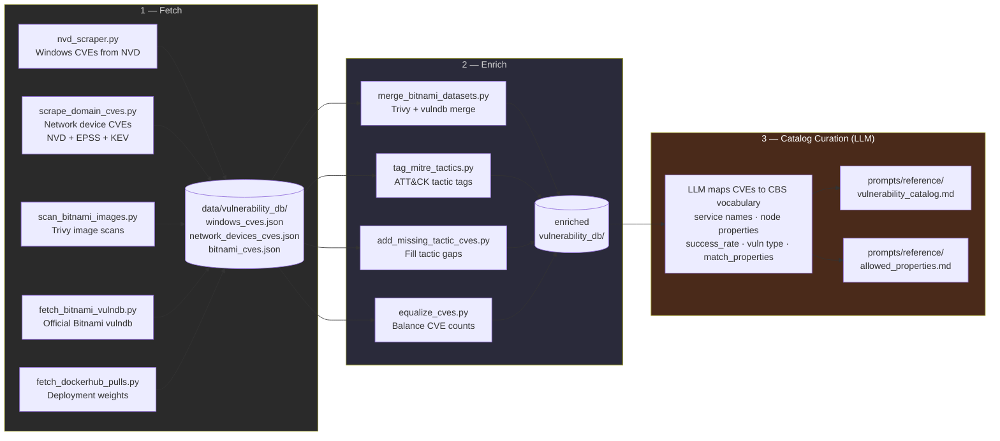
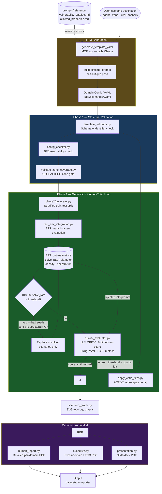

# CyberBattleSim Domain Generator

Generates synthetic enterprise network environments for [CyberBattleSim](https://github.com/microsoft/CyberBattleSim) — used as training data for deep reinforcement learning (DRL) agents in a thesis on automated cyber range generation.

The pipeline takes a natural-language scenario description, produces a validated YAML domain config (Phase 1), then generates stratified training/test scenarios and evaluates them with heuristic agents (Phase 2).

---

## Project Structure

```
CyberBattleSimDomainGenerator/
│
├── cbsim/                        # Core generator package
│   ├── generator.py              # Main network generator (UniversalNetworkGenerator)
│   ├── domain_loader.py          # YAML domain config parser
│   ├── goal_normalizer.py        # Post-processing: normalizes goal nodes
│   ├── vulnerability_library.py  # Vulnerability catalog
│   └── components/               # Generation sub-systems
│       ├── node_builder.py
│       ├── constraint_engine.py
│       ├── topology_manager.py
│       ├── vulnerability_manager.py
│       ├── solvability_constraint_processor.py
│       ├── solvability_post_processor.py
│       ├── credential_bank.py
│       ├── network_utils.py
│       └── vulnerability_library_manager.py
│
├── data_preprocessing/           # One-time data acquisition + CVE curation (run before pipeline)
│   ├── nvd_scraper.py            # NVD API v2 → Windows CVEs JSON
│   ├── scrape_domain_cves.py     # NVD/EPSS/KEV → network device CVEs JSON
│   ├── scan_bitnami_images.py    # Trivy image scans → bitnami_cves.json
│   ├── fetch_bitnami_vulndb.py   # Official Bitnami vulndb → bitnami_vulndb_cves.json
│   ├── fetch_dockerhub_pulls.py  # DockerHub pull counts → deployment weights
│   ├── merge_bitnami_datasets.py # Trivy + vulndb → bitnami_combined_cves.json
│   ├── trivy_scanner.py          # Trivy wrapper
│   ├── trivy_to_config.py        # Trivy results → config prompt intelligence
│   ├── repo_analyzer.py          # GitHub repo structure analysis
│   ├── add_missing_tactic_cves.py  # Fill gaps per MITRE tactic in CVE JSONs
│   ├── equalize_cves.py          # Equalise CVE counts across domain configs
│   ├── tag_mitre_tactics.py      # Add ATT&CK tactic tags to CVE database
│   ├── mitre_attack_analysis.py  # Classify CVEs → MITRE tactics report
│   └── build_manifests.py        # Build per-agent training manifests
│
├── pipeline/                     # Pipeline package (called as subprocesses by MCP server)
│   ├── run.py                    # Full pipeline orchestrator (actor-critic improvement loop)
│   ├── phase1/                   # Phase 1 — config validation
│   │   ├── pipeline.py           # Phase 1 orchestrator
│   │   ├── 01_template_validator.py   # Step 1 — schema + identifier check
│   │   ├── 02_config_checker.py       # Step 2 — BFS reachability check
│   │   ├── 03_validate_zone_coverage.py  # Step 3 — GLOBALTECH zone gate
│   │   ├── _04_quality_evaluator.py   # Step 4 — LLM CRITIC (6-dimension score)
│   │   ├── quality_evaluator.py       # Import shim → _04_quality_evaluator
│   │   └── _05_apply_critic_fixes.py  # Step 5 — LLM ACTOR (auto-repair config)
│   ├── phase2/                   # Phase 2 — scenario generation + evaluation
│   │   ├── 01_generator.py            # Step 1 — stratified train/test generation
│   │   ├── 02_test_env_integration.py # Step 2 — BFS heuristic-agent evaluation
│   │   ├── 03_evaluator.py            # Step 3 — per-scenario metrics aggregation
│   │   └── dataset.py                 # BFS-verified stratified dataset generator
│   └── reporting/                # Report generation
│       ├── 01_scenario_graph.py       # Step 1 — SVG topology graphs
│       ├── 02_human_report.py         # Step 2a — EDA plots + per-domain PDF
│       ├── 02_executive.py            # Step 2b — cross-domain LaTeX PDF
│       ├── 02_presentation.py         # Step 2c — slide-deck PDF
│       ├── cve_scenario_graphs.py
│       ├── bitnami.py            # Bitnami Helm chart CVE EDA report
│       ├── latex_base.py         # LaTeX helpers
│       ├── section_compiler.py   # PDF section compiler
│       ├── sections/             # 14 LaTeX section modules
│       └── analysis/             # EDA analysis library
│           ├── domain_analysis.py    # DomainAnalysis class
│           └── cbs_eda_graphs.py     # 13 EDA plot suites (matplotlib)
│
├── mcp_server/                   # MCP server (exposes pipeline tools to Claude)
│   ├── domain_generator_mcp.py   # 16 MCP tools (generate, run, evaluate, fix, report)
│   └── README.md
│
├── prompts/                      # Reference library for LLM prompt construction
│   ├── llm_prompts/              # System prompt, anti-patterns, quality criteria
│   ├── docs/schema/              # Schema definition, architecture rules
│   ├── docs/reference/           # Properties dictionary, vulnerability catalog
│   ├── examples/                 # Golden single/cross-domain YAML examples
│   └── tools/                   # Validation checklist
│
├── data/                         # Domain config YAML files
├── scripts/                      # Standalone thesis utilities (not part of the pipeline)
│   ├── generate_thesis_data.py
│   ├── generate_single_domain.py
│   ├── generate_dag.py
│   ├── goal_analysis.py
│   ├── goal_audit.py
│   ├── fixup_goals.py
│   ├── metric_extractor.py
│   ├── rename_folders.py
│   └── validate_data.py
│
├── cli.py                        # Entry point: generate one scenario from a YAML config
├── .env                          # Local environment config (see .env.example)
└── .env.example                  # Template for environment config
```

---

## Quick Start

### 1. Configure output location

```bash
cp .env.example .env
# Edit DATASET_ROOT to your desired output path
```

### 2. Use Claude with the MCP server

The project exposes a full pipeline via the MCP server, which Claude uses through `.mcp.json`. Open this folder in Claude Code and use the slash commands:

| Command | Description |
|---------|-------------|
| `/full-pipeline <description>` | Run the full auto-generate → evaluate → retry pipeline |
| `/phase2 <config_path>` | Run Phase 2 on an existing Phase 1 YAML config |

Example:
```
/full-pipeline Enterprise Active Directory with 3 tiers and Domain Controller goal
```

### 3. Generate a single scenario directly

```bash
python cli.py None data/enterprise_ad_3tier_v1.yaml output/my_scenario/
```

---

## Data Preprocessing (`/preprocess-data`)

Run once before the pipeline. Fetches CVEs from external sources, enriches them with MITRE
tactic tags, and uses an LLM to map them into CBS vocabulary — producing the reference files
the generation pipeline draws from.



---

## Generation Pipeline (`/full-pipeline`)

Runs per scenario. The reference files produced by data preprocessing are loaded as context
for every LLM call.



---

## LLM Agents

Three LLM calls are made during the pipeline. Each has a distinct role and a different context package.

### 1. Generator — `generate_template_yaml` (MCP tool)

**Model:** Claude (Anthropic API)  
**When:** User invokes the MCP tool with a scenario description.  
**Context loaded:**

| File | Role |
|------|------|
| `prompts/system_prompt.md` | Master generation instructions |
| `prompts/schema/definition.md` | Full YAML field reference |
| `prompts/schema/architecture.md` | Zone + topology rules |
| `prompts/anti_patterns.md` | AP-001–AP-023 failure modes to avoid |
| `prompts/docs/reference/vulnerability_catalog.md` | All CVE anchors + success rates |
| `prompts/docs/reference/allowed_properties_dictionary.md` | Valid node property tokens |
| `prompts/examples/golden_single_domain.yaml` (or `golden_cross_domain.yaml`) | Gold-standard output example |
| `prompts/evaluation/validation_checklist.md` | 10-point self-check before finalising |

**Output:** Draft domain config YAML → passed through `build_critique_prompt` (self-critique pass) → written to `data/scenarios/`.

### 2. Critic — `quality_evaluator.py` (Phase 2)

**Model:** Claude or Gemini (configurable via env)  
**When:** After every BFS evaluation round in Phase 2.  
**Context loaded:**

| Content | Role |
|---------|------|
| Full config YAML text | Config under evaluation |
| Inline GLOBALTECH zone reference (from `ref.md` Part 2) | Zone-alignment scoring |
| BFS runtime metrics (solve rate, diameter, density, per-stratum) | Injected as structured data |
| 7-dimension rubric (inline) | Topology realism, CVE grounding, difficulty, firewall realism, general realism, scenario coherence, template alignment |

**Output:** JSON with `overall_score /10`, per-dimension scores + findings, `top_issues`, `summary`. Saved as `quality_evaluation.json` per round.

### 3. Actor — `apply_critic_fixes.py` (Phase 2, conditional)

**Model:** Claude or Gemini  
**When:** When critic score < threshold AND rounds remain.  
**Context loaded:**

| File | Role |
|------|------|
| Original config YAML | The config to repair |
| Critic JSON output (`top_issues` + dimension findings) | What specifically failed |
| BFS runtime metrics | Solve rate, diameter |
| `prompts/docs/reference/allowed_properties_dictionary.md` | Valid property tokens |
| `prompts/docs/reference/vulnerability_catalog.md` | Valid CVE anchors |

**Output:** Repaired YAML text (overwrites the config file) → pipeline loops back to Phase 1.

---

## Environment Variables (`.env`)

| Variable | Default | Description |
|----------|---------|-------------|
| `DATASET_ROOT` | `./datasets` | Root for all generated outputs |
| `MAX_RETRIES` | `10` | Max full-pipeline retries |
| `PHASE1_MIN_SCORE` | `7.0` | Min quality score to proceed to Phase 2 |
| `PHASE2_MIN_SOLVE_RATE` | `0.50` | Min heuristic solve rate to pass |
| `PHASE2_TRAIN_COUNT` | `5` | Training scenarios per stratum |
| `PHASE2_TEST_COUNT` | `2` | Test scenarios per stratum |
| `PHASE2_STRATA` | `small` | Comma-separated strata (small/medium/large) |
| `PHASE2_MAX_STEPS` | `5000` | Max steps per episode |
| `PHASE2_NUM_AGENTS` | `3` | Concurrent heuristic agents |
| `PHASE2_MAX_EPISODES` | `3` | Episodes per scenario |

---

## Dependencies

- Python 3.10+ (conda env: `cybersim`)
- [CyberBattleSim](https://github.com/microsoft/CyberBattleSim) — installed in the `cybersim` conda environment
- `cyberbattlesim_network_gen` — network generator base classes
- `mcp`, `pyyaml`, `matplotlib`, `networkx`, `pyvis` — see `mcp_server/requirements.txt`
